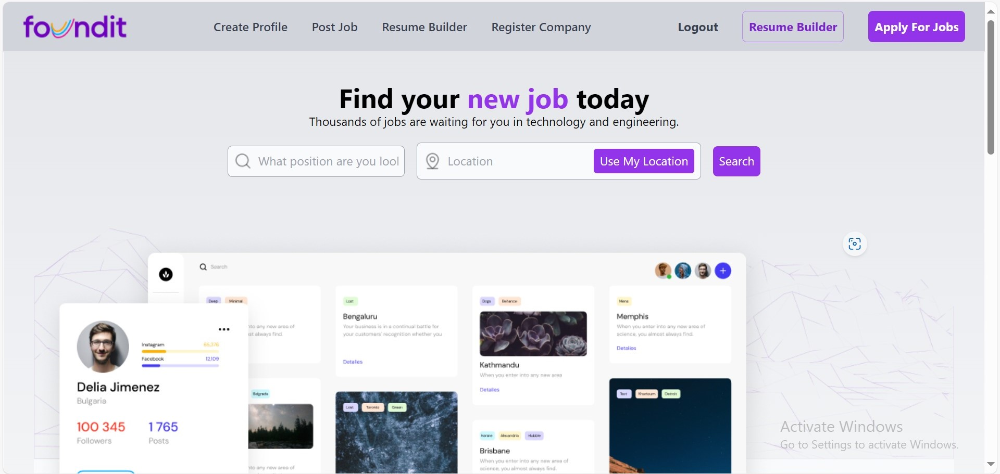

# Frontend Application

## Description
This project is a Nodejs-based backend application designed to enhance user experiences with features such as job searching, AI-powered resume building, and more. The app aims to simplify the job-seeking process by providing intuitive tools for job seekers, including personalized job recommendations,  and easy navigation to various career-related resources.

## Features
- **Job Search**: Search for job opportunities across different categories and locations.
- **User Profile**: Create and manage your profile to save job applications, resumes, and personal details.
- **Job Alerts**: Get notifications for new job postings matching your skills and preferences.
- **Responsive Design**: Mobile-friendly design optimized for a seamless experience across devices.

## Table of Contents
- [Installation](#installation)
- [Usage](#usage)
- [Features](#features)
- [Contributing](#contributing)
- [License](#license)

## Installation

To get the application up and running locally, follow these steps:

1. Clone the repository:
   ```bash
   git clone https://github.com/your-username/JobPortalBackend.git

2. Change Directory into Frontend Folder:
   ```bash
   cd backend

3. Start your app:
   ```bash
   nodemon server.js

   
   
